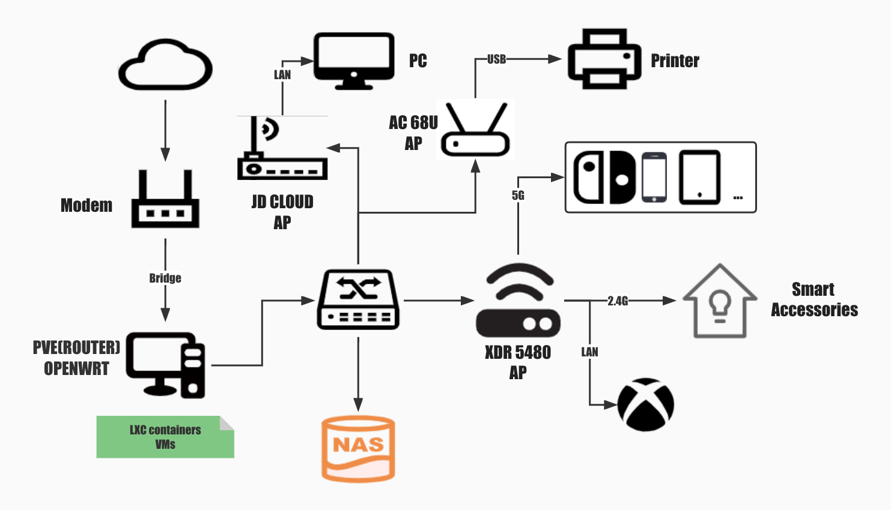

## Introduction
> Reference(Plagiarism🤣):
> 
> https://www.right.com.cn/forum/thread-4053183-1-1.html
> https://blog.csdn.net/kangzeru/article/details/115373587

😄This artical is just a **reminder** for myself, not a tutorial. Hopefully it helps you too.

My configuration is as below:

| Accessory   | Type                            |
|:-----------:|:-------------------------------:|
| CPU         | Intel i7-6700                   |
| MOTHERBOARD | ASUS Z170 Pro Gaming            |
| NET ADAPTER | RTL 8125B(with 2 2.5G RJ45)     |
| DISKS       | Q200EX 480G,PM961A 256G,ZFS:1TB |
| SYSTEM      | PVE 7.2-4                       |

The network topology is as below:


:::tip
I've found a repository [**pve-edge-kernel**](https://github.com/fw867/pve-edge-kernel), it seems to cover configuration and template of LXC openwrt. Anyone interested can hava a try on your own.
:::

## Steps

### Create the LXC template

Here I used is the **slim** release of [nanopi-openwrt](https://github.com/klever1988/nanopi-openwrt) made by **klever1988** for that it is simple enough but with the basic extensions installed(*e.g. FULLCONE, Argon Theme*).

:::caution
If your PVE lacks FULLCONE, you may need to build it from the source.
Here attached the [**tutorial**](https://blog.sxx1314.com/linux/587.html)
:::

Download the firmware you like

```shell
cd /var/lib/vz/template/cache/
wget https://github.com/klever1988/nanopi-openwrt/releases/download/2022-07-08/x86-slim.img.gz
```
:::tip 
If the image you've downloaded is `rootfs.tar.gz`, you can jump to [**Create the LXC container**](#create-the-lxc-container).
:::
Mount all the partitions in this raw disk image

```shell
kpartx -av x86-slim.img.gz 
```

Under the `/dev/mapper`, there are 2 ***loopXpY***, one of this contains the Openwrt System.(*e.g. loop0p1*)

Mount it to path `/mnt`

```shell
mount /dev/mapper/loop0p1 /mnt
```

Package it to `rootfs.tar.gz`

```shell
tar zcvf openwrt-x86-64-generic-rootfs.tar.gz /mnt/
```

Unmount

```shell
umount /mnt
kpartx -d x86-slim.img.gz
```

### Create the LXC container

#### PVE CLI Commands

```shell
pct create <vmid> <ostemplate> [OPTIONS]
```
| Name | type | Description |
|:----:|:----|:------------|
| <kbd>vmid</kbd>| `integer`(**1-N**) | The (**unique**) ID of the VM |
| <kbd>ostemplate</kbd>| `string` | The OS template or backup file (`local:vztmpl/openwrt-x86-64-generic-rootfs.tar.gz`) |

##### Options

| Name | type | Description |
|:----:|:----|:------------|
| <kbd>--rootfs</kbd>| `storage`:`disksize` | Use volume as container root. |
| <kbd>--ostype</kbd>| `alpine` or `debian` etc. | OS type. |
| <kbd>--hostname</kbd>| `string` | Set a host name for the container. |
| <kbd>--arch</kbd>| `amd64`,`arm64`,`armhf`,`i386` | OS architecture type. |
| <kbd>--cores</kbd>| `integer`(**1-8192**) | The number of cores assigned |
| <kbd>--memory</kbd>| `integer`(**16-N**) | Amount of RAM for the VM in MB. |
| <kbd>--swap</kbd>| `integer`(**0-N**) | Amount of SWAP for the VM in MB. |

:::tip PCT Commands
The more detailed infomation about PVE is available at [PCT-DOCs](https://pve.proxmox.com/pve-docs/pct.1.html).
:::

#### Initialize a LXC container

With the upper commands, we can initialize a container

```shell
pct create 100 
    local:vztmpl/openwrt-x86-64-generic-rootfs.tar.gz
    --rootfs local-lvm:8 
    --ostype unmanaged 
    --hostname openwrt 
    --arch amd64 
    --cores 4 
    --memory 1024 
    --swap 0 
    -net0 bridge=vmbr1,name=eth1
```

#### Modify the configuration of container

Add the content of below:

```shell title="/etc/pve/lxc/100.conf"
# there are some basic configurations in openwrt.common.conf
# which is already existed in PVE system
lxc.include: /usr/share/lxc/config/openwrt.common.conf
# allow /dev/ppp for openwrt dial up with PPPOE protocal
lxc.cgroup.devices.allow: c 108:0 rwm
# assign a specific hookscript
hookscript: local:snippets/hookscript.pl
# Passthrough the physical network card for container
lxc.net.1.type: phys
lxc.net.1.link: enp6s0
lxc.net.1.flags: up
```

:::caution
The container will always load the `/usr/share/lxc/config/openwrt.common.conf` whatever you add it to the configuration of lxc container or not
:::

:::important
If you will use <kbd>openclash</kbd> in your container or happen to see the error with this format **"Unable to set capabilities *[sth.]* ..."**, you need to modify the `openwrt.common.conf`

Comment this 2 lines in below file.(***[sth.]*** you lack, and the line where it locates should be commented)

```shell title="/usr/share/lxc/config/openwrt.common.conf"
# lxc.cap.drop is meant to discard some capabilities
lxc.cap.drop = sys_ptrace
lxc.cap.drop = sys_resource
```
:::

#### Create the hookscript

Here we used the official example `guest-example-hookscript.pl` to modify

Create the folder

```shell
mkdir /var/lib/vz/snippets
```

Copy the `guest-example-hookscript.pl` to the folder

```shell
cp /usr/share/pve-docs/examples/guest-example-hookscript.pl /var/lib/vz/snippets/hookscript.pl
```

Edit this file, you will see the content below at line 36:

```python title="/var/lib/vz/snippets/hookscript.pl"
    # Second phase 'post-start' will be executed after the guest
    # successfully started.

    print "$vmid started successfully.\n";
```

Add the content below to enable **TUN** and **PPPOE**:

```python title="/var/lib/vz/snippets/hookscript.pl"
    # Second phase 'post-start' will be executed after the guest
    # successfully started.
    system("lxc-device add -n $vmid /dev/ppp");
    system("lxc-device add -n $vmid /dev/net/tun");
    print "$vmid started successfully.\n";
```

### Start the LXC container

Start the specific container with `VMID` and then start the LXC terminal

```shell
pct start 100
lxc-attach 100
```

Configure your network

```shell title="/etc/config/network"
config device
        option name 'br-lan'
        option type 'bridge'
        list ports 'eth1'

config interface 'lan'
        option device 'br-lan'
        option proto 'static'
        option ipaddr '192.168.1.5'
        option netmask '255.255.255.0'

config interface 'wan'
        option device 'enp6s0'
        option proto 'pppoe'
        option username 'xxxxxx'
        option password 'xxxxxx'
```

Restart the network and firewall

```shell
/etc/init.d/network restart
/etc/init.d/firewall restart
```

## Start surfing on the Internet

**🎉Congratulations!**  
Now, you may already have Internet access. You can add further configuration such as installing plugins, adjusting your settings with web interface at http://192.168.1.5

